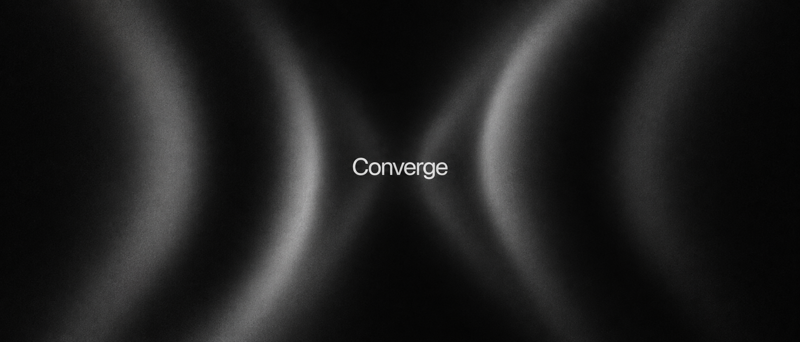

# Converge — Design System

The visual language for every Converge surface. Written before the app exists, so the first components inherit decisions rather than invent them.

**Status:** Foundation drafted, pending sign-off.
**Source of truth for:** color, type, the dithered field, motion, form, icons.
**Not the source of truth for product rules.** Information architecture, flows, gates and privacy live in the locked docs indexed by [AGENTS.md](../../AGENTS.md) and [INDEX.md](../INDEX.md) — [auth.md](../auth.md), [onboarding.md](../onboarding.md), [pre-hackathon.md](../pre-hackathon.md), [day-of.md](../day-of.md). Where this system names a moment, it uses the locked journey vocabulary: **Join, Looking, Match, Team, Find, Want to be found**.

---

## Where it comes from

One image set the direction: a pure black field, two beams of light converging to a narrow waist, heavy grain, and a small off-white wordmark sitting exactly at the point of convergence.

Everything in this system is an attempt to make that image into a product rather than a picture.

---

## Read in this order

| Doc | What it settles |
|-----|-----------------|
| [field.md](field.md) | **Start here.** The dithered light field — recipe, parameters, how convergence carries state |
| [proof/field-renderer.js](proof/field-renderer.js) | The field itself. Dependency-free ES module; the app imports this, not a copy of it |
| [color.md](color.md) | The luminance ladder, and the strict budget on hue |
| [type.md](type.md) | Kanit, Schibsted Grotesk, Martian Mono — scale and rules |
| [form.md](form.md) | Radius, space, layout, elevation without shadow |
| [motion.md](motion.md) | Two motion domains, easings, durations, reduced motion |
| [icons.md](icons.md) | Lucide base geometry; morphicons vs animate-ui |

---

## Five principles

**1. Convergence is state, not decoration.**
The field's waist is driven by a real number from the product — how many people are looking, whether a like was returned, how far away someone is. When the beams tighten, something happened. A field that moves for no reason is a bug.

**2. The ground is black and the only accent is light.**
Hierarchy is built from luminance, not from color. Red and green exist in this system as instruments for two narrow jobs; they are never the brand.

**3. Light has no corners; interfaces do.**
Anything that runs to a viewport edge is square. Contained surfaces curve in proportion to their weight, and nested surfaces stay concentric.

**4. Three faces, three jobs, no overlap.**
Kanit is the voice and never goes below 16px. Schibsted Grotesk carries everything a person actually reads. Martian Mono is reserved for values that must be counted or transcribed.

**5. One loud thing per screen.**
The field is the loud thing. Everything around it is quiet on purpose — no shadows, no decorative gradients, no reveal-on-scroll. Restraint elsewhere is what lets the field land.

---

## Boundaries

Written down so the system cannot quietly drift into a template.

**Black is `#000000`.** Not `#0B0B0B`, not `#111`. A tinted near-black is the single most common tell of a generated interface, and here it also breaks the effect — the beams must read as emitted light, which needs a true black ground.

**No shadows. Anywhere.** On a black ground a drop shadow is invisible or fake. Elevation is a surface luminance step plus a dithered hairline. If something needs to float, raise its luminance.

**No gradient outside the three field tiers.** Gradients are the identity here, which means they cannot also be filler. A gradient that is not the field is wrong.

**No hue as decoration.** See the seven rules in [color.md](color.md). The accent of this brand is white light.

**No typographic template chrome:**
- No ALL-CAPS labels
- No eyebrow labels above headings
- No `→` appended to button or link text
- No `A · B · C` middle-dot meta strings
- No accenting a single word in a heading with weight, italic or color

**One orchestrated moment per route.** The field resolving on page load is the moment. Section-by-section fade-and-slide on scroll is not a design, it is a default.

**Every state must survive losing color and motion.** Turn off hue and the interface still reads. Turn on `prefers-reduced-motion` and nothing becomes unusable or ugly.
